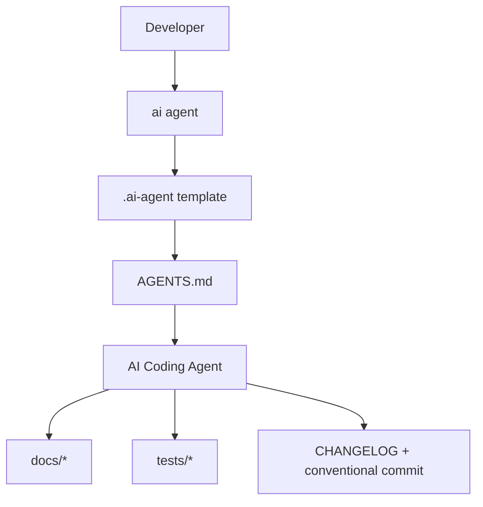

# Architecture

## Overview
System enforces deterministic, high-discipline agent workflows using modular skills and project-level operating rules.

## Diagram

```mermaid
graph TD
Developer --> Command[ai agent]
Command --> Template[.ai-agent template]
Template --> ProjectRules[AGENTS.md]
ProjectRules --> AgentRun[AI Coding Agent]
AgentRun --> Docs[docs/*]
AgentRun --> Tests[tests/*]
AgentRun --> CommitFlow[CHANGELOG + conventional commit]
```
