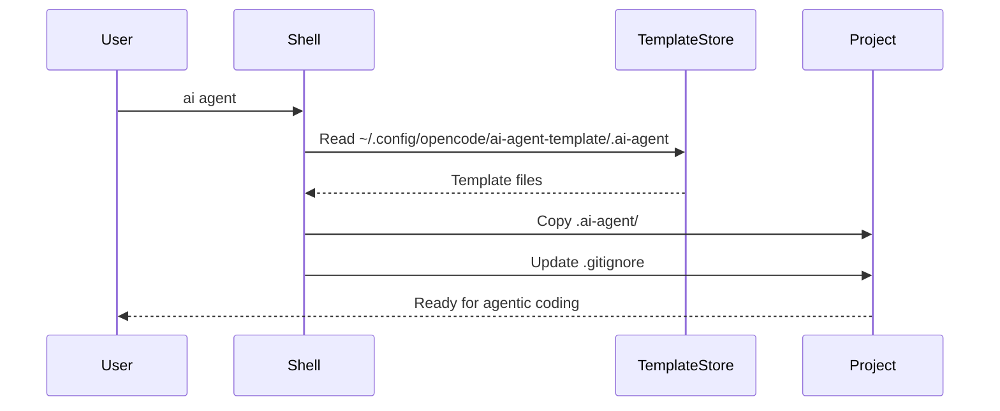

# Data Flow

## Flow

```mermaid
sequenceDiagram
User->>Shell: ai agent
Shell->>TemplateStore: Read ~/.config/opencode/ai-agent-template/.ai-agent
TemplateStore-->>Shell: Template files
Shell->>Project: Copy .ai-agent/
Shell->>Project: Update .gitignore
Project-->>User: Ready for agentic coding
```
