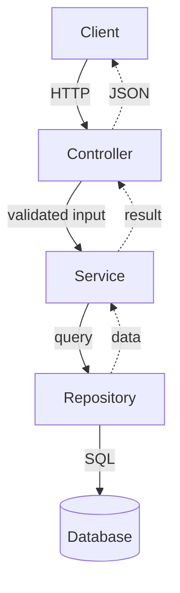
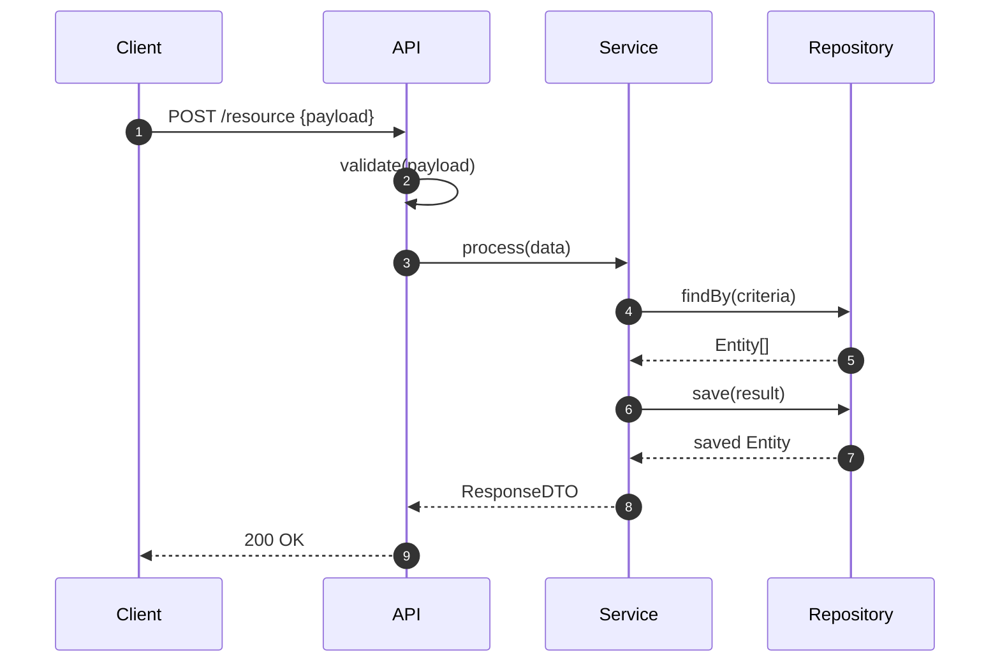

# Architecture Documentation Rules

## docs/architecture.md MUST include
- High level description (2-3 sentences)
- Component responsibilities table
- Mermaid architecture diagram

Example:

## docs/data-flow.md MUST include
- Detailed request/response flow
- Function-level explanation
- Mermaid sequence diagram with autonumber
- Error flow diagram

Example:

## docs/considerations.md MUST include
- Why this architecture (alternatives considered)
- Design decisions (context / choice / reason / tradeoff)
- Known limitations
- Future improvements with reason why not done now

## Diagram Maintenance Rules
- Update immediately when a new component is added
- Update immediately when a flow changes
- If code changes, diagrams change - never let them drift
