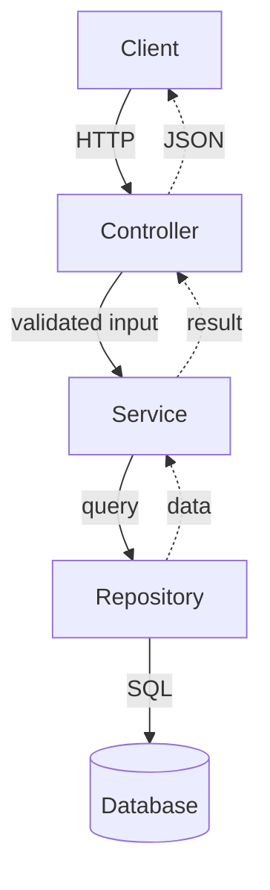

# Architecture

## Overview

<2-3 sentences describing the system, its components, and key design choice>

This system follows a layered architecture so each concern is isolated and testable.
Controllers only handle transport concerns (HTTP input/output), services hold business rules, repositories isolate persistence concerns, and utility functions remain stateless.
This split keeps change impact local: API changes stay in controllers, rule changes stay in services, and storage changes stay in repositories.

## Components

| Component | Responsibility |
|-----------|---------------|
| Controller | HTTP request/response only |
| Service | Business logic and orchestration |
| Repository | Data access and persistence |
| Utils | Pure, stateless helpers |

## Detailed Interaction Notes

- Request validation is performed before business execution to fail fast and reduce downstream ambiguity.
- Services should return explicit result objects or domain errors; controllers are responsible for mapping these to HTTP responses.
- Repositories should never contain business branching logic. Their role is deterministic data retrieval and persistence.
- Utilities should not access external systems or global mutable state.

## Diagram

## Why This Layout Works

- It improves maintainability because each layer has one dominant reason to change.
- It supports testability because service logic can be validated independently of transport and storage adapters.
- It improves replacement flexibility because API and storage technologies can evolve without rewriting core business rules.
