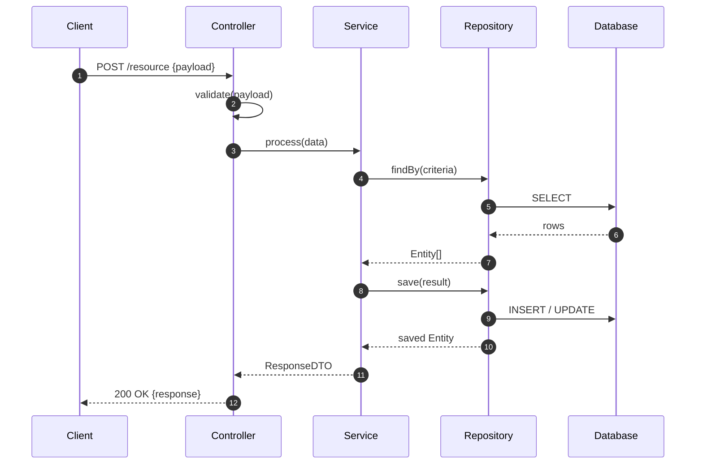
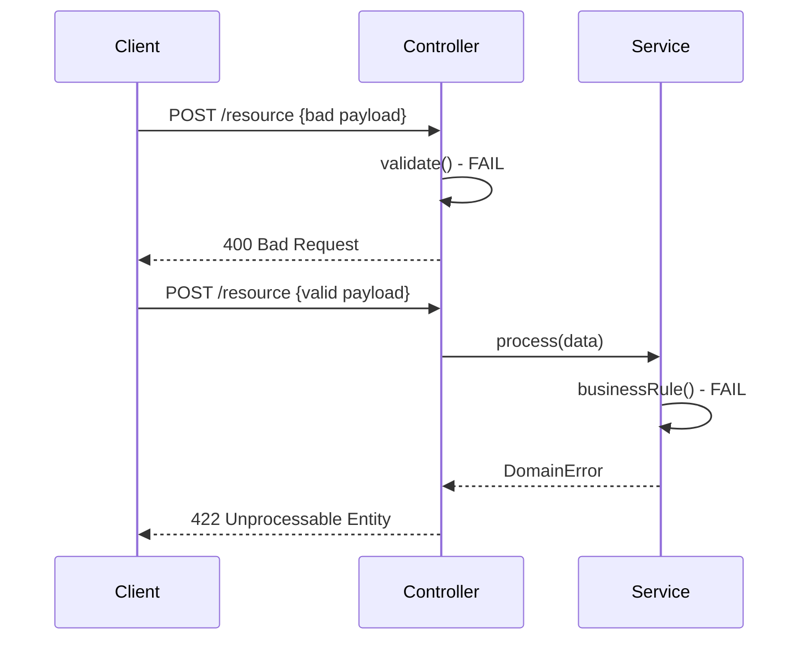

# Data Flow

## <Flow Name>

### Flow Description

Describe the user intent, input shape, expected output, and the business rule boundaries for this flow.
Explain what must be validated at the controller layer versus what must be enforced in the service layer.

### Step-by-Step Behavior

1. Client sends a request payload.
2. Controller validates and normalizes input.
3. Service executes business logic and orchestrates persistence calls.
4. Repository performs data read/write operations.
5. Service maps persistence results into a response contract.
6. Controller returns a stable API response.

## Error Flow

### Error Handling Description

Document each error category and where it originates.
At minimum, cover validation errors (client input), business rule errors (domain constraints), and unexpected errors (infrastructure/runtime).
Define how each category maps to status code and error body format.

### Error Response Contract

- Validation error example: `{ "code": "VALIDATION_ERROR", "message": "...", "details": [...] }`
- Domain error example: `{ "code": "DOMAIN_RULE_FAILED", "message": "..." }`
- Unexpected error example: `{ "code": "INTERNAL_ERROR", "message": "Request failed" }`
